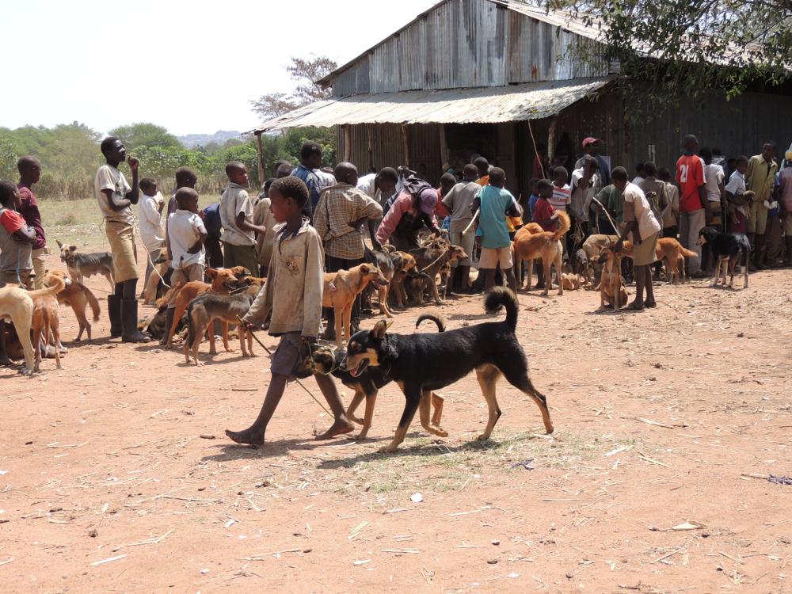
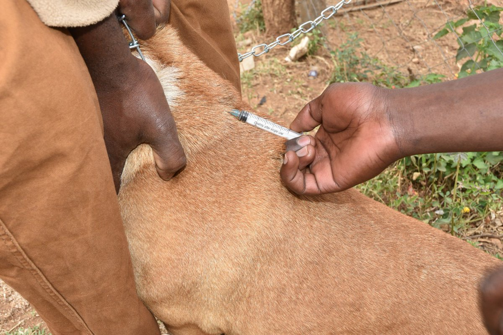

<!--Add a loading bar!-->

<link href="pace_loadbar_loading.css" rel="stylesheet" />

<!--Create a block for title and breadcrumbs to appear on same line-->

<h1>Rabies Control</h1>

<ol class="breadcrumb" style="background-color:white;">
  <li class="breadcrumb-item"><a href="index.html">Home</a></li>
  <li class="breadcrumb-item"><a href="about_overview.html">Project Background</a></li>
  <li class="breadcrumb-item active">Rabies Control</li>
</ol>

 
  
<!--Begin page content!-->
Worldwide, around 60,000 human rabies deaths occur annually. Although the virus is transmitted by a wide range of mammals, a large proportion of these deaths are from the bites of infected domestic dogs. Rabies can be effectively controlled by implementing high coverage and comprehensive dog vaccination programmes.  
  
Our team has supported the local government in Serengeti District in conducting domestic dog vaccination campaigns in Serengeti District since 2003, using a <a href="https://www.sciencedirect.com/science/article/pii/S0264410X08013078?via%3Dihub", target="blank">central point strategy</a>. Over this time period, we have increased the number of villages included in campaigns, and the number of dogs vaccinated.  
  
[Click here](data_vax.html) to view our data on dog vaccination campaigns, including maps of villages covered.  

  
  
Central point vaccination station

  
  
Dog vaccination

  