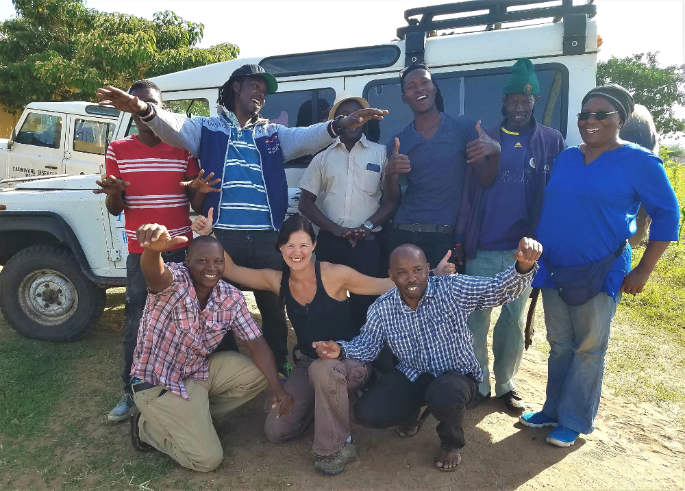

<!--Add a loading bar!-->

<link href="pace_loadbar_loading.css" rel="stylesheet" />

<!--Begin page content!-->
In Tanzania, we carry out research on rabies epidemiology, prevention and control. Our work in Tanzania has contributed to multi-country and global studies to inform policy and practice.

This website provides information from long-term contact tracing and vaccination campaigns in Serengeti District, Northwest Tanzania.  
  
If you would like to explore our research in other parts of Tanzania or return to our central hub, please use the globe icon in the top right.    
  
 

